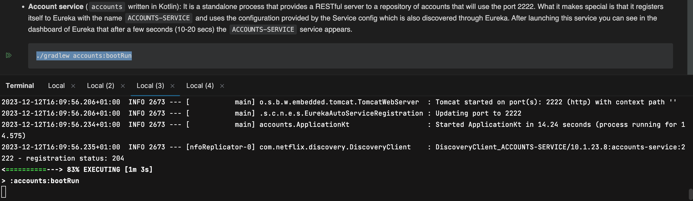
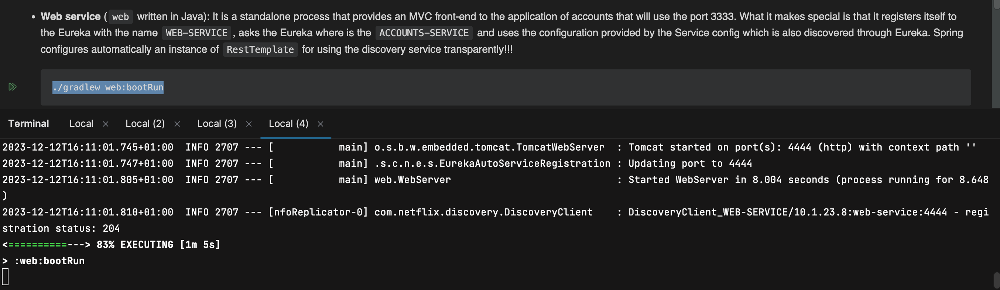
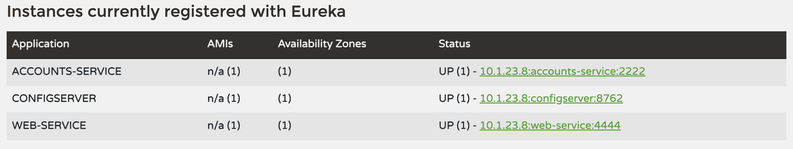
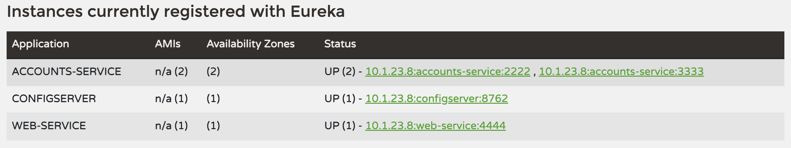
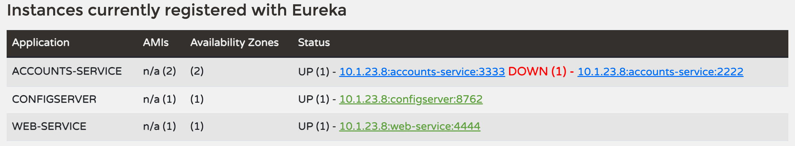
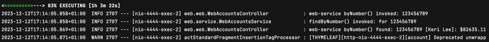
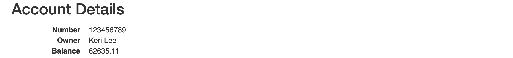

# Laboratorio 6 - Microservicios

###### David Rivera Seves (815124)

### 0. Link to the repository.
https://github.com/davidrseves/lab6-microservices-config-repo

### 1. Two services accounts (2222) and web are running and registered.
- Modificar accounts-service.yml, para que inicie en el puerto 2222

Accounts (2222) iniciado:

Web iniciada:

### 2. The service registration service has these two services registered.
Eureka dashboard:

### 3. Update the configuration repository so that the accounts service uses now the port 3333.
<https://github.com/davidrseves/lab6-microservices-config-repo/commit/28f84fd760a72e1fc6ec7f9a95adacb74c47a9a1>

### 4. Run a second instance of the accounts service using the new configuration. What happens?
- Modificar accounts-service.yml, para que inicie en el puerto 3333

Comprobamos que modificando el puerto y al lanzar nuevamente el servicio, se puede hacer sin necesidad de para los servicios.  

Eureka dashboard:

### 5. What happens when you kill the service accounts (2222) and do requests to web?.

Vemos, en el dashboard, que el servicio que hemos matado, sale como DOWN.

Eureka dashboard:

Realizamos una petición a la web, y sigue funcionando todo correctamente, podemos ver como el account (3333) es el que nos devuelve la petición.

Accounts (3333)

### 6. Can the web service provide information about the accounts again?. Why?
El servicio de accounts sigue funcionando corrrectamente, y por lo tanto, podemos seguir obteniendo información de accounts.

Petición de accounts

